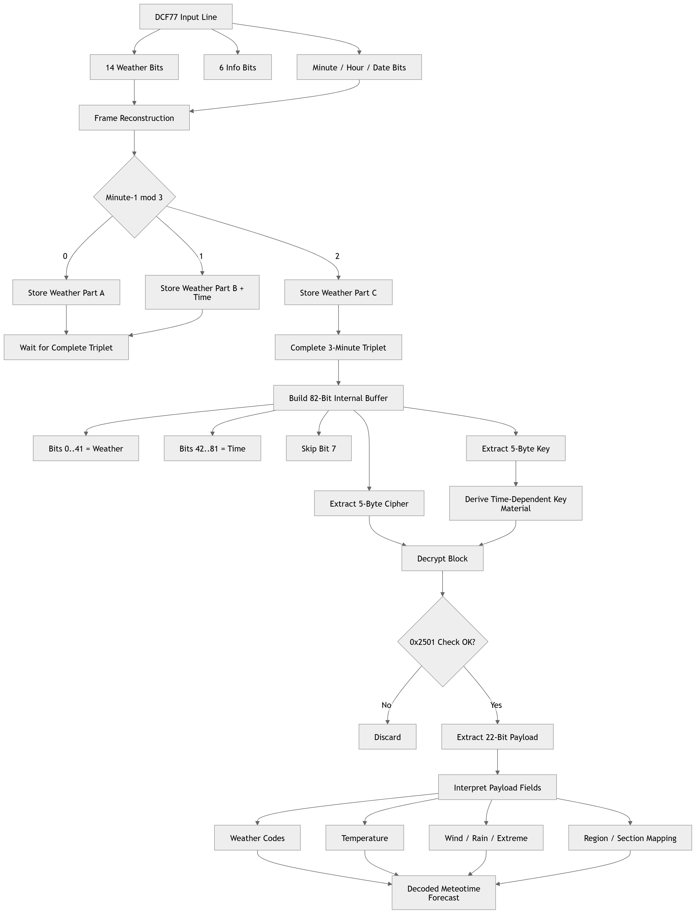

# DCF77 Meteotime Decoder


Decoding encrypted Meteotime weather data from the DCF77 signal — from raw bits to forecast.
---

## 📡 Overview

This project demonstrates how to decode **Meteotime weather data** transmitted via the **DCF77 time signal (77.5 kHz)**.

It reconstructs the full decoding chain:

* Bitstream interpretation
* 3-minute frame reconstruction
* Decryption and validation
* Weather data extraction and mapping

👉 Result:
From raw RF signal to **human-readable weather data**

---

## ✨ Features

* Full Meteotime decoding implementation
* Correct 3-minute frame reconstruction
* 82-bit buffer handling (weather + time)
* Decryption with time-derived key
* Validation using **0x2501 magic check**
* Extraction of:

  * Temperature
  * Weather conditions
  * Wind / rain information
* Region and forecast mapping

---

## ▶️ Usage

### Requirements

* Python 3.8 or newer
* No external libraries required (standard library only)

---

### Included Test Data

The repository contains one sample log file:

* `DcfLog.txt`

---

### Run the Decoder

Basic usage:

```bash
python meteotime_weather_mapped_with_region.py DcfLog.txt
```

---

### Optional Parameters

Show more decoded records:

```bash
python meteotime_weather_mapped_with_region.py DcfLog.txt -n 25
```

Enable verbose output (cipher, key, plain data):

```bash
python meteotime_weather_mapped_with_region.py DcfLog.txt -v
```

Export decoded data to CSV:

```bash
python meteotime_weather_mapped_with_region.py DcfLog.txt --csv output.csv
```

Combine options:

```bash
python meteotime_weather_mapped_with_region.py DcfLog.txt -n 10 -v --csv output.csv
```

---

## ⚙️ How It Works

1. Parse DCF77 log lines
2. Extract weather bits and time fields
3. Assemble **3-minute Meteotime frames**
4. Build 82-bit buffer (weather + time)
5. Derive key from time data
6. Decrypt payload
7. Validate using **0x2501**
8. Map result to weather data

---

## 📦 Data Structure

Meteotime data is transmitted in **3-minute frames**:

* Minute n: 14 payload bits
* Minute n+1: 8 payload bits + 6 check bits
* Minute n+2: 14 check bits

👉 Total: **42-bit block per dataset**

---

## 🔐 Encryption

* Substitution-based cipher (S-Boxes)
* Bit permutations
* Key derived from time/date
* No key transmitted

👉 A lightweight broadcast cryptosystem

---

## 📊 Example Output

```text
18.03.26 00:02:00 -> 0x......
  Region:   Central Europe
  Section:  Day 1
  Day:      Rain
  Night:    Cloudy
  Temp:     12 °C
```

---

## 🧠 Background

Meteotime has long been considered difficult to decode due to:

* Missing official documentation
* Encrypted data format
* Non-trivial framing structure

This project shows that with:

* Real signal recordings
* Public reference implementations
* Iterative analysis

👉 Full decoding becomes possible.

---

## ⚠️ Legal Notice

Meteotime is a commercial service and its data format may be subject to intellectual property rights.

This project is intended for **educational and research purposes only**.
It demonstrates the decoding of publicly received DCF77 signals.

The author is not affiliated with, endorsed by, or connected to Meteotime or any related services.

Any use of this project is at your own responsibility.

---

## 🔄 Decoding Pipeline

<p align="center">
  
</p>
